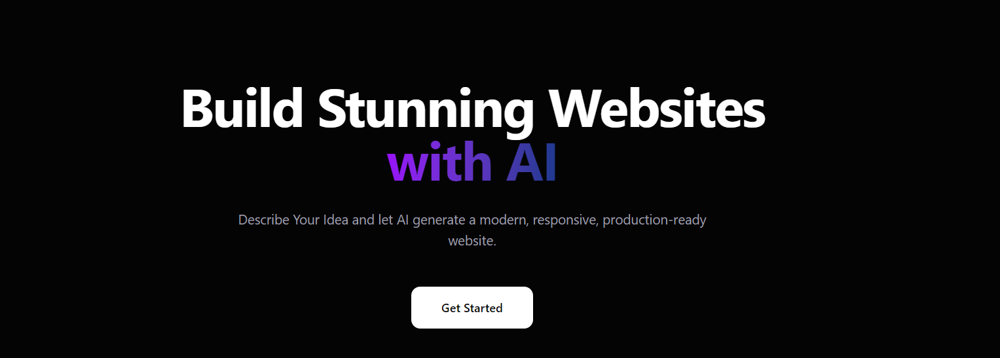
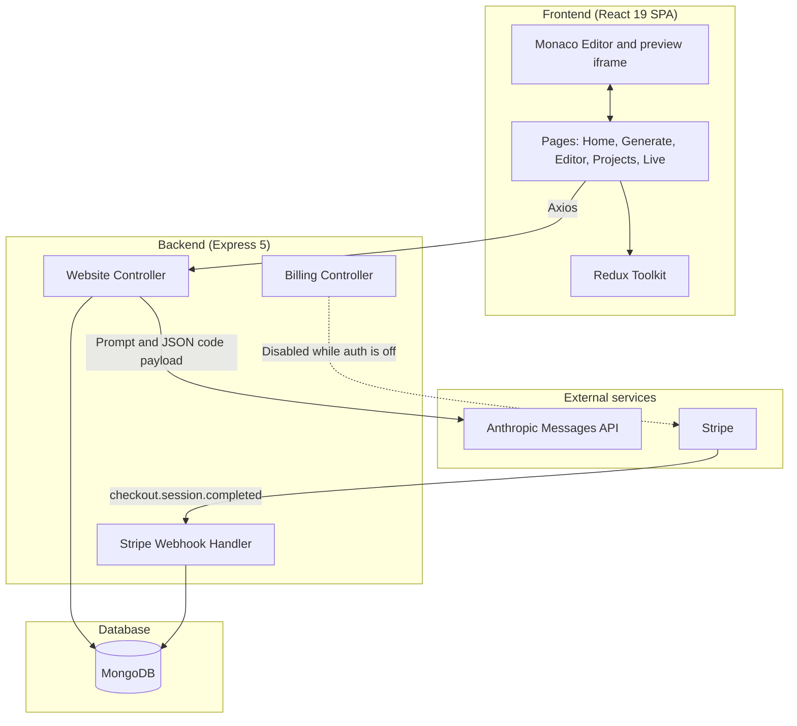
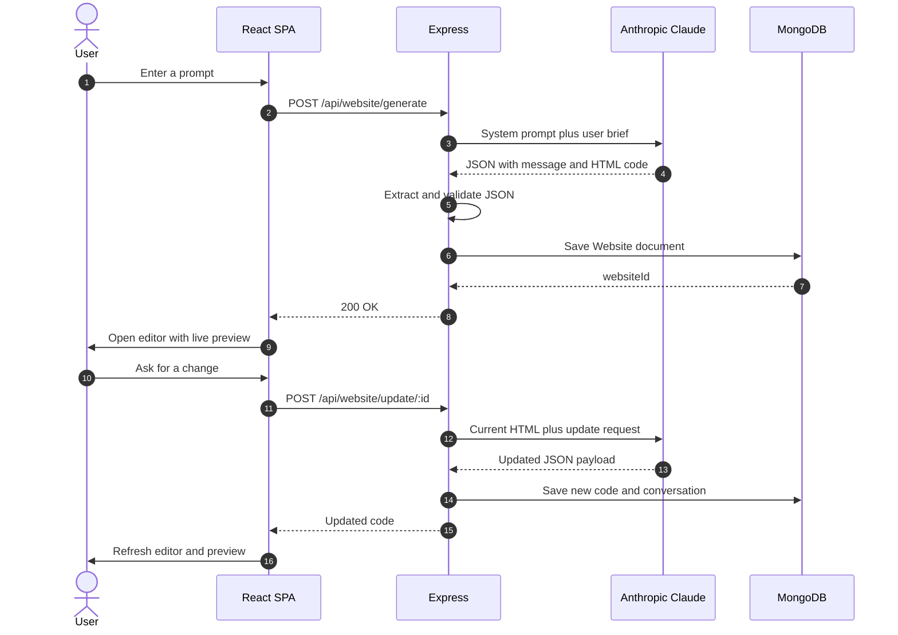
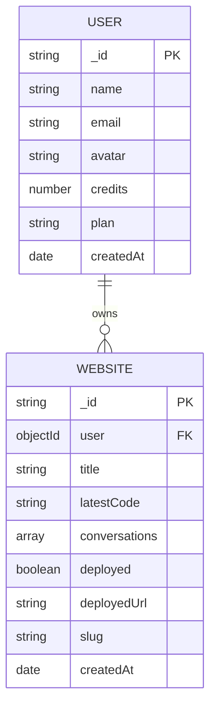

# Nextasoft — AI Website Builder

<p align="center">
  
</p>

<p align="center">
  <a href="https://github.com/devxsubh/gen-web-ai-main" target="_blank">
    
  </a>
  
  <br/>
  
  
  
  
  
  
  
</p>

---

**Nextasoft** is a full-stack AI website builder for Upwork. Describe an idea in plain language and get a complete, responsive HTML/CSS/JS site — with live preview, conversation-style edits, and a shareable public URL.

---

## Features

- **AI-powered generation** — Describe the feel and function; Claude returns a full HTML document
- **Iterative refinement** — Keep prompting to reshape layout, copy, and motion
- **Responsive output** — Generated sites are built to work from phone to desktop
- **Live code editor** — Monaco editor with an isolated iframe preview
- **One-click publish** — Deploy a generated site to a public slug URL (`/site/:slug`)
- **Project library** — Browse, reopen, and share sites from the projects dashboard
- **Plans UI** — Studio / Atelier / House pricing screens (Stripe checkout is currently paused)

---

## Tech Stack

### Frontend (`client/`)

- **React 19** with Vite 8
- **Tailwind CSS 4** for styling
- **Redux Toolkit** for client state
- **Monaco Editor** for code editing
- **Motion** for page animation
- **Axios** for API calls
- **React Router DOM** for routing

### Backend (`server/`)

- **Express 5** REST API
- **MongoDB + Mongoose** for persistence
- **Anthropic Claude** (`claude-haiku-4-5`) for generation
- **Stripe** webhook handler (checkout is currently disabled)
- **Morgan** for request logging

The server loads env from the repo root `.env`, then `server/.env`.

---

## System Architecture

Nextasoft is a decoupled client-server app. The React SPA talks to Express; Express orchestrates Anthropic and stores generated sites in MongoDB.

### 1. High-level overview



### 2. Generation and refinement



### 3. Data model



### 4. How the pieces fit together

- **Decoupled SPA and API** — The Vite client calls Express over HTTP. In production the server can also serve `client/dist`.
- **LLM orchestration** — Express sends a strict system prompt, asks Claude for raw JSON (`message` + `code`), retries once if parsing fails, then stores the HTML.
- **Isolated preview** — Generated markup is rendered in a sandboxed iframe next to Monaco, so edits show up without a server round-trip.
- **Public slugs** — Deploy sets `deployed`, builds a slug from the title plus a short id, and exposes the site at `/site/:slug`.
- **Auth and billing** — User, JWT, and Stripe checkout code still exists in the repo, but authentication is off and `/api/billing` currently returns an error. Generation works without a logged-in user.

---

## Getting Started

### Prerequisites

- Node.js 18+
- MongoDB (local or Atlas)
- Anthropic API key
- Stripe keys (only if you re-enable billing)

### 1. Clone and install

```bash
git clone https://github.com/devxsubh/gen-web-ai-main.git
cd gen-web-ai-main

cd server
npm install

cd ../client
npm install
```

### 2. Environment variables

Copy the examples, then fill in real values. Do not commit `.env` files.

**Root** (`.env`, loaded first by the server):

```env
JWT_SECRET="jwt_secret"
MONGO_URI="your_mongo_uri"
ANTHROPIC_API_KEY="your_anthropic_api_key"
PORT="3002"
FRONTEND_URL="http://localhost:5173"
DB_NAME="gen-web-ai-db"
STRIPE_SECRET_KEY="your_stripe_secret_key"
STRIPE_WEBHOOK_SECRET="your_stripe_webhook_secret"
```

Templates also live at `.env.example` and `server/.env.example`.

**Client** (`client/.env`):

```env
VITE_FIREBASE_API_KEY="your_firebase_api_key"
```

Firebase is listed as a client dependency for future auth work; the current UI does not require this key to generate sites.

### 3. Run in development

```bash
# Terminal 1 — API (http://localhost:3002)
cd server
npm run dev

# Terminal 2 — client (http://localhost:5173)
cd client
npm run dev
```

### 4. Production build

```bash
cd client
npm run build
```

With `NODE_ENV=production`, the Express server serves `client/dist/` and falls back to `index.html` for client routes.

---

## API Endpoints

| Method | Endpoint | Description |
|--------|----------|-------------|
| `POST` | `/api/website/generate` | Generate a new website from a prompt |
| `POST` | `/api/website/update/:id` | Refine an existing website with a follow-up prompt |
| `GET` | `/api/website/get-by-id/:id` | Fetch a website by MongoDB id |
| `GET` | `/api/website/get-by-slug/:slug` | Fetch a published website by slug (used on `/site/:slug`) |
| `GET` | `/api/website/get-all` | List websites (newest first) |
| `GET` | `/api/website/deploy/:id` | Publish the site and return a public URL |
| `POST` | `/api/billing` | Stripe checkout (currently disabled) |
| `POST` | `/api/stripe/webhook` | Stripe webhook for completed checkouts |

Generate request body:

```json
{ "prompt": "A quiet studio site for a ceramicist in Kyoto" }
```

Successful generate response:

```json
{ "websiteId": "..." }
```

---

## App routes

| Path | Page |
|------|------|
| `/` | Landing |
| `/generate` | Compose a new site |
| `/editor/:id` | Monaco editor and live preview |
| `/projects` or `/dashboard` | Project library |
| `/site/:slug` | Public deployed site |
| `/pricing` | Studio / Atelier / House plans |

---

## Plans

| Plan | UI name | Price | Credits (stored on User) |
|------|---------|-------|--------------------------|
| `free` | Studio | ₹0 | 100 |
| `pro` | Atelier | ₹499 | 500 |
| `enterprise` | House | ₹1499 | 1000 |

Credit deduction is not enforced while authentication is off. The User model and Stripe webhook still support plan and credit updates.

---

## Screenshots

<p align="center">
  
  <br/>
  <em>Projects — manage generated websites</em>
</p>

---

## Links

- **GitHub**: [https://github.com/devxsubh/gen-web-ai-main](https://github.com/devxsubh/gen-web-ai-main)
- **Issues**: [https://github.com/devxsubh/gen-web-ai-main/issues](https://github.com/devxsubh/gen-web-ai-main/issues)

---

## License

ISC
